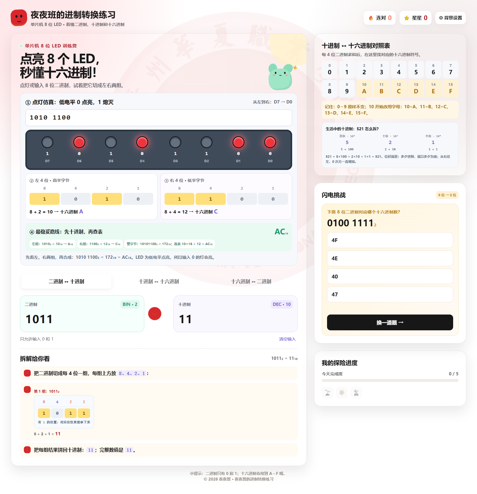
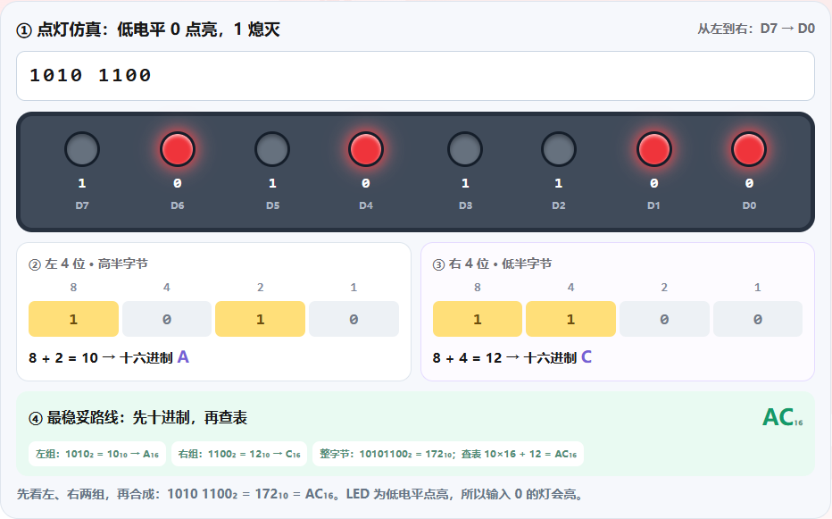
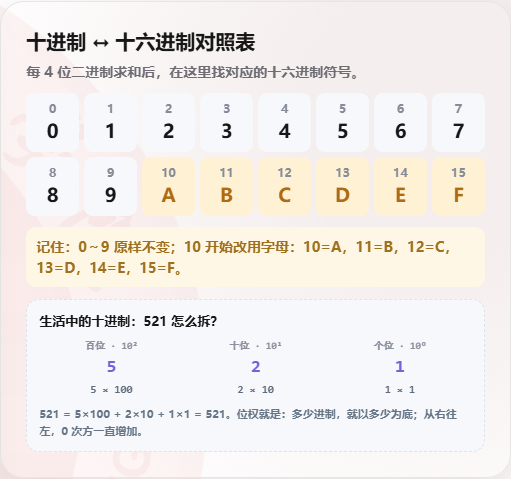
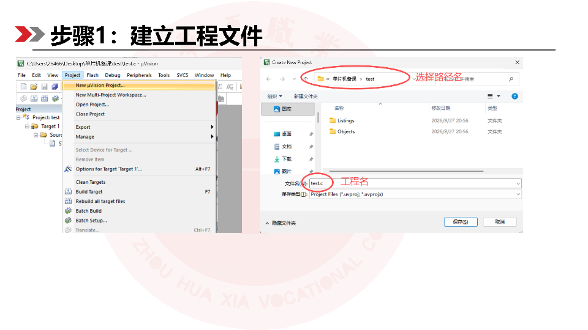

# 夜夜班的进制转换练习

一个面向单片机入门课堂的本地/网页小游戏，帮助学生练习二进制、十进制和十六进制之间的快速转换。

## 适用场景

- 8 位 LED / 单片机端口数据观察
- 二进制按 4 位切分
- 8421 位权快速求和
- 二进制 → 十进制 → 十六进制
- 十进制 0～15 与十六进制 0～F 对照记忆

## 功能

- 8 个 LED 交互仿真：低电平 0 点亮，1 熄灭
- P1 端口 C 代码课堂仿真：把 Keil C51 常用的 `P1 = 0xFE;`、`delay(300);` 写法直接放进编辑器运行
- 支持教材里的 `STC89C52RC.H`、`REGX51.H`、`REG52.H`、`INTRINS.H` 头文件示例，并可直接载入 `_crol_(P1,1)` 循环左移流水灯
- P1 仿真页附带课堂代码示例库：流水灯、不同位置灯闪烁、S2（P3.4）按键控灯、S2 按键控蜂鸣器、S2/S3 左右转向灯
- `_crol_(P1,1)` 流水灯会展开为 8 个连续端口状态，完整经过 P1.0～P1.7，不会只在两个状态之间循环
- 蜂鸣器示例提供独立蜂鸣器外形、发光声波和“按下/松开 S2”演示按钮，用光效表示发声状态
- 内置全亮/全灭闪烁和 P1.0→P1.7 流水灯示例，实时显示 P1 十六进制值、引脚映射和仿真日志
- 按 GTX TX-1C / MCU-2B 资料加入项目二至项目五：独立按键、按键计数、4×4 矩阵键盘、六位数码管动态显示、定时器 0 中断
- 项目三、项目四、项目五均提供可阅读的 Keil C51 代码、拆解步骤和课堂仿真结果
- 独立“实操教程”页：Keil 建工程、添加 C 文件、生成 HEX、Build 编译、STC-ISP 下载的图文流程
- 独立“课堂代码示例”页：每次只显示一个完整 C 程序，按 Keil 风格逐行排版，避免多个程序混在一起
- 蜂鸣器示例完整保留 S2=P3.4 按键判断：按下输出 BEEP=0 发声，松开输出 BEEP=1 静音，并提供蜂鸣器光效仿真
- 左右两个 4 位半字节分别计算
- 8421 位权动态教程
- 十进制位权示例：521 = 5×100 + 2×10 + 1×1
- 校徽背景和卡片/选项卡透明度设置
- 纯 HTML/CSS/JavaScript，无需安装依赖

## 页面功能导览

### 1. 8 位 LED 仿真教学区

输入 8 位二进制或点击 LED 切换状态。页面采用单片机常见的低电平点亮逻辑：输入 `0` 时灯亮，输入 `1` 时灯灭；下方会把 8 位数据切成左右两个 4 位半字节。

### 2. P1 端口 C 代码仿真工作台

学生可以把课堂中的 P1 控制片段直接粘贴到编辑器，点击“运行仿真”观察 8 个 LED。当前教学子集支持：

- `P1 = 0x00;`、`P1 = 0xFF;`、`P1 = 254;` 等直接赋值
- `P1 = 0xFE; delay(300);` 这样的时序写法
- `P1 |= 0x01;`、`P1 &= ~0x01;`、`P1 ^= 0x01;`、简单移位表达式
- 页面内置闪烁和流水灯示例，可作为学生改写练习的起点

仿真按照 STC89C52RC 的 PORT 1 八个 I/O 位显示 P1.0～P1.7，并保留开发板常见的低电平点亮 LED 逻辑。它是浏览器里的课堂快速反馈工具，不执行完整 C 编译，也不替代 Keil 编译、下载和真实开发板验收；后续可继续扩展按键、蜂鸣器和数码管模块。

### 3. 项目二至项目五

根据 TX-1C 原理图和开发板说明书，网页中的实验页现在包含：

- **项目二 独立按键**：网页教学键位统一写作 S1～S4，不再使用“SS1”这类重复命名；真实 TX-1C 转向灯示例按板上丝印使用 S2=P3.4、S3=P3.5。
- **项目三 按键计数**：点击 S1，模拟消抖后的单次计数，并在数码管样式显示区显示结果。
- **项目四 4×4 矩阵键盘**：用 P1.0～P1.7 模拟行列扫描，点击 16 个键查看扫描值。
- **项目五 数码管动态显示**：用 P0 段码、74HC573 和 74HC138 位选的课堂模型，演示六位数码管快速轮询。
- **项目五定时器与中断**：按 PPT 中的定时器 0 模式 1、ET0/EA/TR0 和中断服务函数示例，说明如何用定时器替代长时间 Delay。

每个项目卡片都同时保留“现象 → 步骤 → C 代码 → 代码解释”，适合教师边演示边讲解。

当前页面按资料中的 MCU-2B/TX-1C 接线实现；如果实物板批次有改线，应以板上丝印和原理图为准。

### 4. 8421 位权动图教程

每组 4 位的上方对应 `8、4、2、1`。二进制中为 `1` 的位置会动态高亮，学生可以直接把这些位权拿下来相加，得到十进制数。

### 5. 十进制与十六进制对照表

提供 `0～15` 对应 `0～F` 的速查表，并配有 `521 = 5×100 + 2×10 + 1×1` 的十进制位权示例。

### 6. 实操教程

“实操教程”页把你提供的 Keil 与 STC-ISP 截图按 1～13 步配成卡片，明确区分“编译生成 HEX”和“下载写入单片机”，并提供 P1 LED 最小 C 程序与课堂验收清单。

### 7. 背景与透明度设置

校徽背景、内容卡片和选项卡都提供 `0～100%` 透明度滑块，设置会保存在本机；网页背景可以按课堂投影或个人练习需要调整。

## 在线访问

在线教学网站由 Sites 托管：

https://ye-ye-ban-base-converter.zcq991029.chatgpt.site

GitHub 仓库只用于公开保存源码、素材和版本记录，不启用 GitHub Pages。

静态发布目录为 `dist/`，`.openai/hosting.json` 保存 Sites 项目标识和目录配置。

## 本地运行

直接双击 `index.html` 即可运行。

## 版权与署名

© 2026 夜夜班 · 夜夜班的进制转换练习
